## Simple Application demonstrating Passwordless authentication and subsequent MFA opt-in & Social Connection Upgrade

So you basically:

```
1) start with passwordless, using email magic link
2) when you are ready to create a dropbox account, you opt to "sign up" by selecting "Link Dropbox"
3). when you are ready to opt-in to Multi-Factor authentication - you can easily do so - using [duo](https://duo.com/)
```

### Prerequisites

In order to run this example you will need to have `Java 8` and `Maven` installed. You can install Maven with [brew](http://brew.sh/):

```sh
brew install maven
```

Check that your maven version is 3.0.x or above:
```sh
mvn -v
```

This project relies upon `Spring Boot`.


Benefits of Spring Boot, in particular for traditional server-side web application / microservices architectures:

**Automatic configuration** - Spring Boot can automatically provide configuration for application functionality common to many Spring applications.

**Starter dependencies** - Tell Spring Boot what kind of functionality you need, and it will ensure that the libraries needed are added to the build.

**Command-line interface** - Optional feature of Spring Boot lets you write complete applications with just application code, but no need for a traditional
 project build.

**The Actuator** - Gives you insight into what's going on inside of a running Spring Boot application.


### Setup

Create an [Auth0 Account](https://auth0.com) (if not already done so - free!).


#### From the Auth0 Dashboard

Create an application - for the purposes of this sample - `app`

Ensure you add the following to the settings.

Allowed Callback URLs:

```
http://localhost:3099/callback
http://localhost:3099/mcallback
```

Ensure you add the following to the settings.

Allowed Logout URLs:

```
http://localhost:3099/logout
```

Now, please ensure you set up both a

```
Passwordless Email Connection (Connections -> Passwordless -> Email)
Dropbox Social Connection (Connections -> Social -> Dropbox)
```

Both of these connection types NEED to be associated with the application you have created - `app`


Next, enable MFA - Multi-Factor Authentication, and configure with the following - supplying your own values:

Here we illustrate Duo Security, but this could be any `MFA` including `Google Authenticator` and our Auth0 `Guardian` solution.


```
function (user, context, callback) {
  var CLIENTS_WITH_MFA = ['{YOUR_CLIENT_ID}'];
  // run only for the specified clients
  if (CLIENTS_WITH_MFA.indexOf(context.clientID) !== -1) {
    // we only want users whose app_metadata is updated with mfa flag = true to use this
    if (user.app_metadata && (user.app_metadata.mfa === true)){
      context.multifactor = {
        //required
        provider: 'duo',
        ikey: '{INTEGRATION_KEY}',
        skey: '{SECRET_KEY}',
        host: '{API_HOSTNAME}',

         ignoreCookie: false,

      };
    }
  }
  callback(null, user, context);
}
```

You will have to set up a (free) account with Duo Security, to obtain the integration key, secret key, and api hostname.

That's it for the Dashboard setup!


### Update configuration information

Enter your:

`client_id`, `client_secret`, `domain`, and `managementToken` information into `src/main/resources/auth0.properties`


For the `managementToken` token, you shall need to visit our [management api page](https://auth0.com/docs/api/management/v2#!/Users/patch_users_by_id)

Ensure you select `update:users_app_metadata` grant.

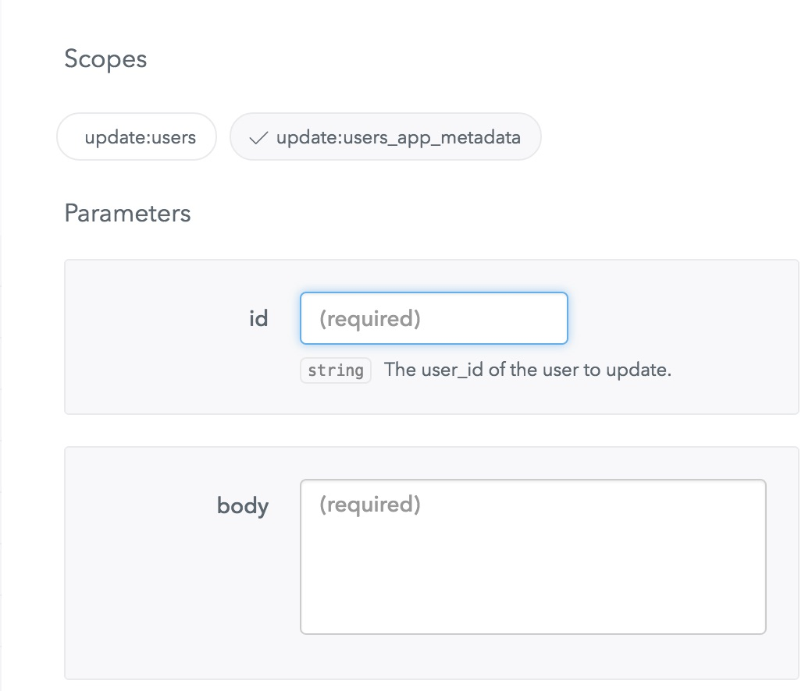

Copy the generated management token

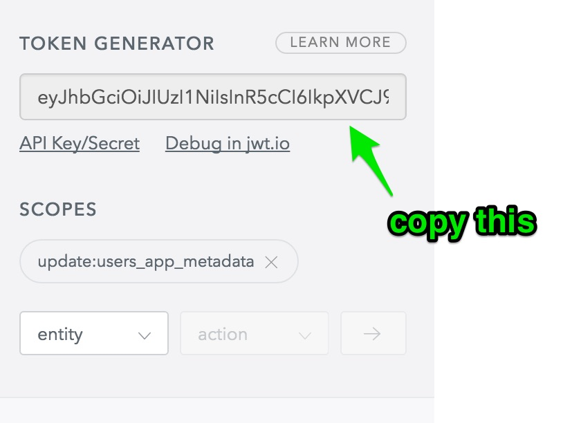


### Build and Run

In order to build and run the project you can simply execute the following using `maven`:

```sh
mvn spring-boot:run
```

Alternatively, you can build to an executable jar file and run as follows:

```sh
mvn clean package
```

```sh
java -jar target/auth0-spring-boot-sample-web-jsp-0.0.1-SNAPSHOT.jar
```


Then, go to [http://localhost:3099/login](http://localhost:3099/login).

---

### Here are some screenshots of the overall flow (minus the Growler notifications!):


Please note that `auth0` offers two primary libraries for UI authentication - `lock` and `auth0.js`.

This sample offers examples of both but defaults to using `lock` for passwordless authentication.


#### 1.Login

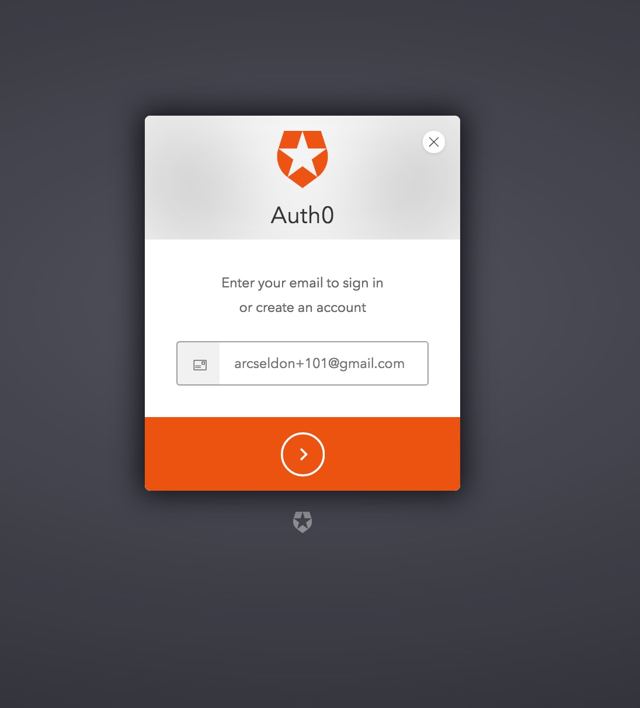

Alternatively, you could roll your own and use `auth0.js`

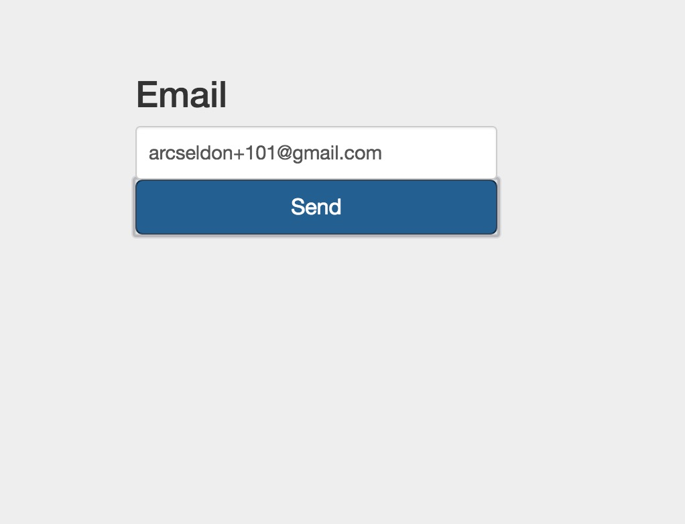

#### 2.Email

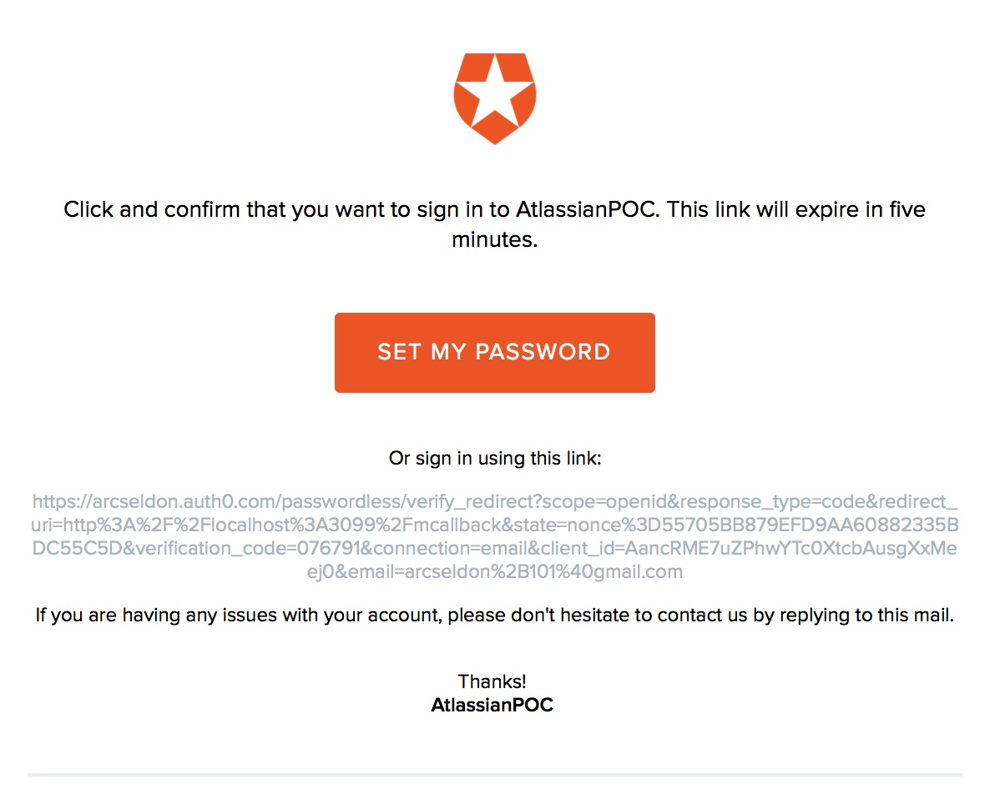

#### 3. Home

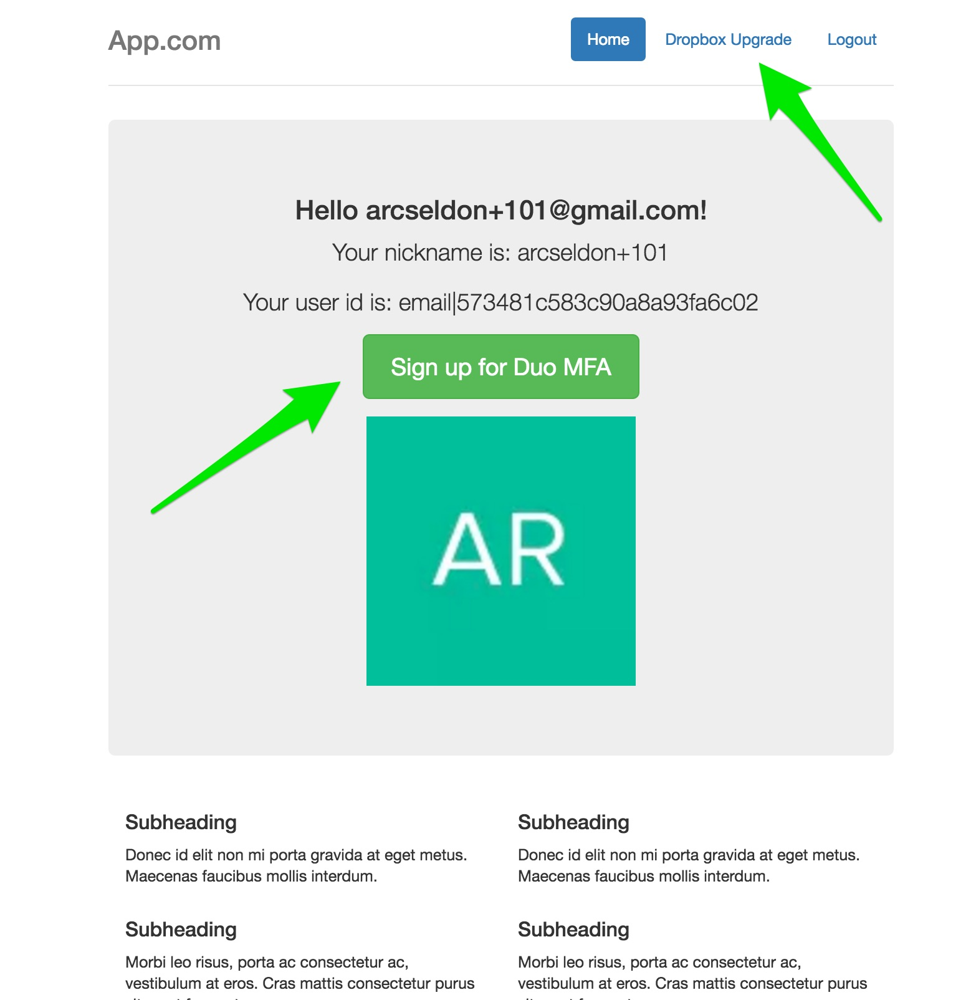

#### 4. Dropbox Link Accounts

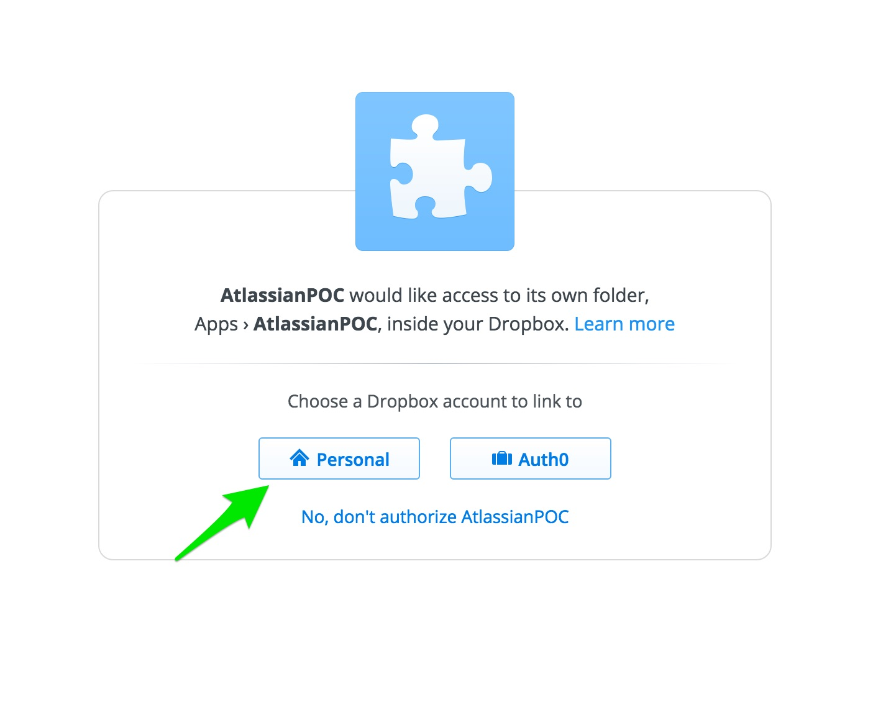

#### 5. Home

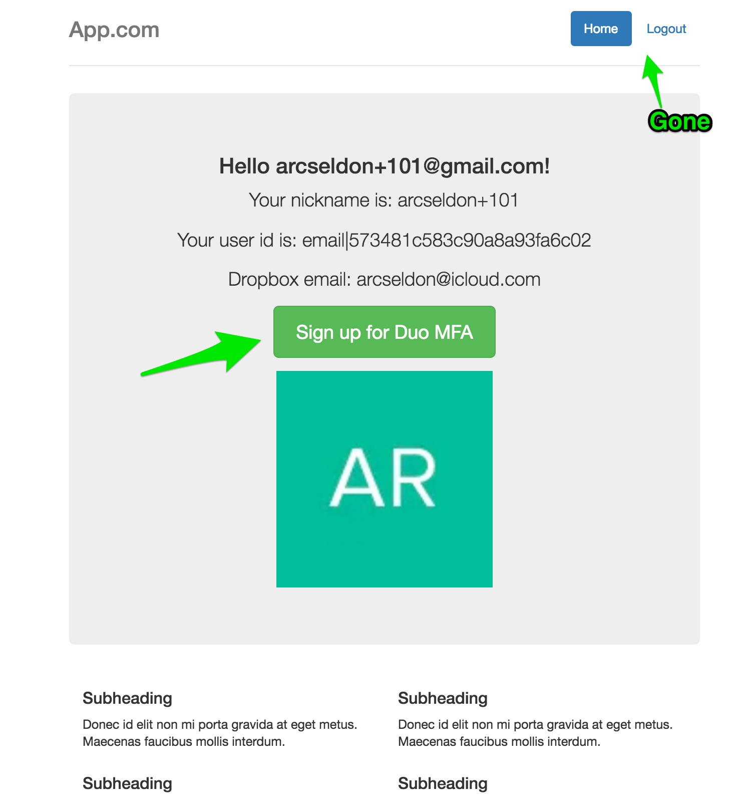

#### 6. Login


#### 7. Mail

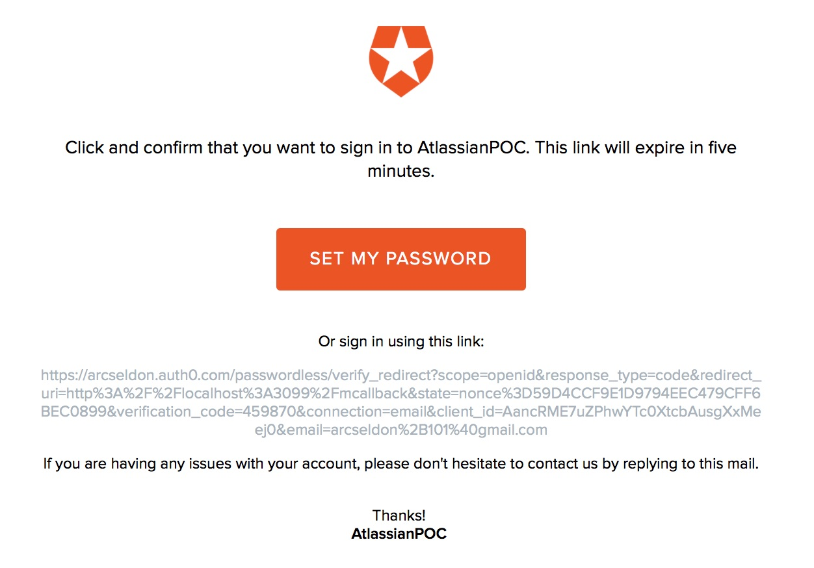


At this point, depending on which underlying Multi-factor Authentication provider you have configured for use, you would
go through the registration process for that provider, and once complete return to the application home page, as shown
in the next screenshot.


#### 8. Home

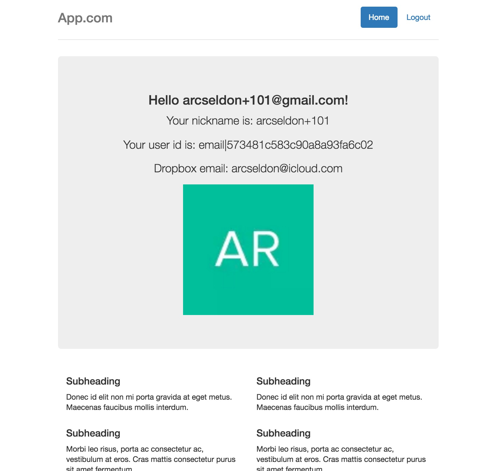

#### 9. User Profile upon completion

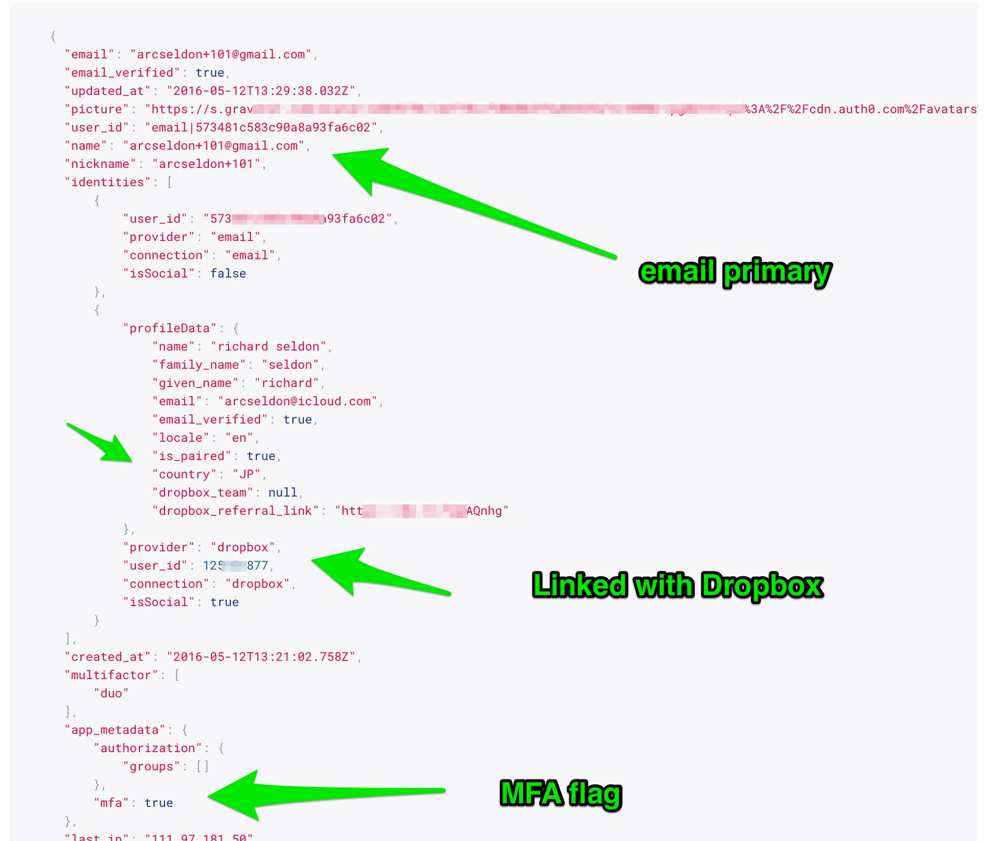


Finally, in addition, using Spring Boot `actuator` we can easily verify various health and performance statistics for our running application.

Here are just a few of the available endpoints:

```
http://localhost:3099/metrics
http://localhost:3099/health
http://localhost:3099/mappings
http://localhost:3099/env
```

## License

The MIT License (MIT)

Copyright (c) 2016 AUTH10 LLC

Permission is hereby granted, free of charge, to any person obtaining a copy
of this software and associated documentation files (the "Software"), to deal
in the Software without restriction, including without limitation the rights
to use, copy, modify, merge, publish, distribute, sublicense, and/or sell
copies of the Software, and to permit persons to whom the Software is
furnished to do so, subject to the following conditions:

The above copyright notice and this permission notice shall be included in
all copies or substantial portions of the Software.

THE SOFTWARE IS PROVIDED "AS IS", WITHOUT WARRANTY OF ANY KIND, EXPRESS OR
IMPLIED, INCLUDING BUT NOT LIMITED TO THE WARRANTIES OF MERCHANTABILITY,
FITNESS FOR A PARTICULAR PURPOSE AND NONINFRINGEMENT. IN NO EVENT SHALL THE
AUTHORS OR COPYRIGHT HOLDERS BE LIABLE FOR ANY CLAIM, DAMAGES OR OTHER
LIABILITY, WHETHER IN AN ACTION OF CONTRACT, TORT OR OTHERWISE, ARISING FROM,
OUT OF OR IN CONNECTION WITH THE SOFTWARE OR THE USE OR OTHER DEALINGS IN
THE SOFTWARE.
